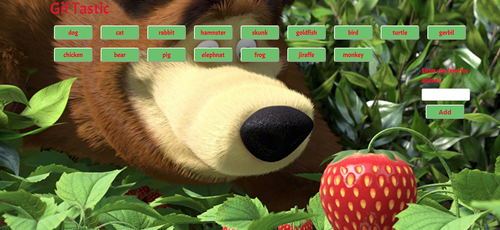

# Gif-Tastic
App that allows you load images from Giphy API to make a dynamic web page that populates with gifs of your choice

# How works
You can click on the button and see dynamics gifs that can be animated if you want.Otherwise you can add animals of you preference and will be add it dynamicly into the page.If the animal exists the app will show you an error.

# Technology used
Jquery

Boostrap

Ghypy Api

Ajax

JSON

# Demo Link
https://idalmys.github.io/Gif-Tastic/
